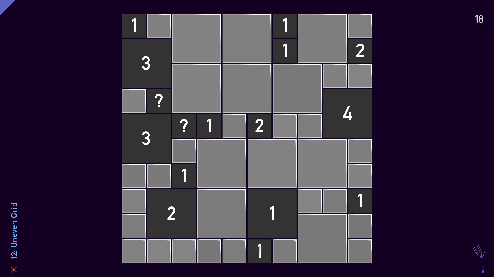
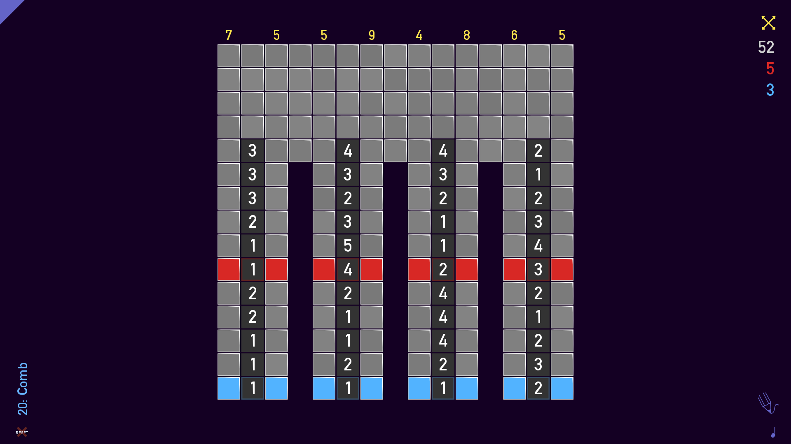

# Tametsi Solver

Tametsi is a minesweeper based puzzle game in which every level is solvable by using only logic, no luck required.
This project's purpose is to discover and implement an algorithm capable of solving some of the levels of this game (namely the ones that have rectangular shapes only, as it is difficult to show the other ones in a CLI).

# Currently implemented levels

## Level 6

## Level 9

## Level 12

## Level 13

## Level 18

## Level 20

## Level 21

## Level 23

## Level 25

## Level 27

## Level 28

## Level 30

## Level 32

## Level 36

## Level 37

## Level 38

## Level 42

## Level 43

## Level 44

## Level 47

## Level 48

# Planned levels

## Level 34

## Level 46

## Level 50

## Level 52

## Level 53

## Level 54

## Level 55

## Level 56

## Level 57

## Level 59

## Level 60

## Level 61

## Level 63

## Level 64

## Level 65

## Level 67

## Level 69

## Level 70

## Level 71

## Level 73

## Level 75

## Level 76

## Level 78

## Level 79

## Level 80

## Level 82

## Level 84

## Level 85

## Level 87

## Level 88

## Level 89

## Level 92

## Level 93

## Level 94

## Level 95

## Level 97

## Level 98

## Level 100

    Official Reference:
    Tametsi
    Available on Steam
    Developer: Grip Top Games
    Release Year: 2017